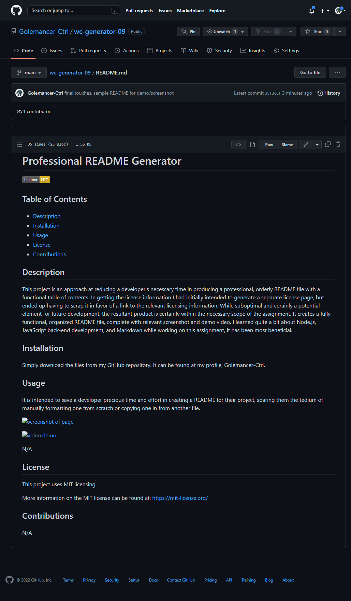

# Professional README Generator

## Table of Contents
- [Description](#description)
- [Installation](#installation)
- [Usage](#usage)
- [License](#license)
- [Contributions](#contributions)

## Description
This project is an approach at reducing a developer's necessary time in producing a professional, orderly README file with a functional table of contents.  In getting the license information I had initially intended to generate a separate license page, but ended up having to scrap it in favor of a link to the relevant licensing information.  While suboptimal and cerainly a potential element for future development, the resultant product is certainly within the necessary scope of the assignment.  It creates a fully functional, organized README file, complete with relevant screenshot and demo video.  I learned quite a bit about Node.js, JavaScript back-end development, and Markdown while working on this assignment, it has been most beneficial.

## Installation
Simply download the files from my GitHub repository.  It can be found at my profile, Golemancer-Ctrl.

## Usage
It is intended to save a developer precious time and effort in creating a README for their project, sparing them the tedium of manually formatting one from scratch or copying one in from another file.

## License
This project uses MIT licensing.

More information on the MIT license can be found at:
https://mit-license.org/

## Contributions
N/A

